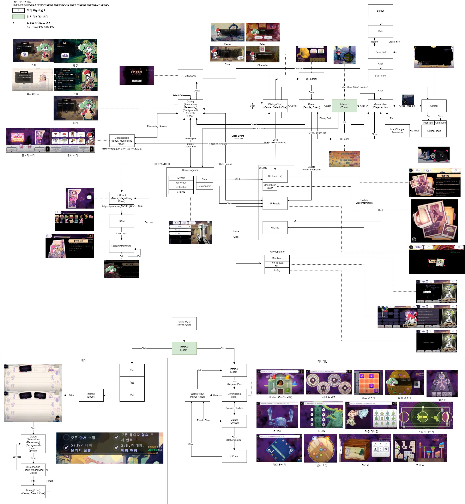
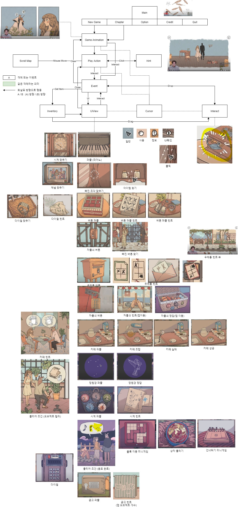
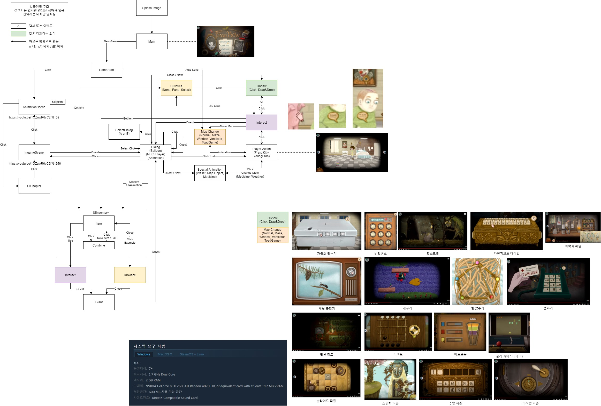
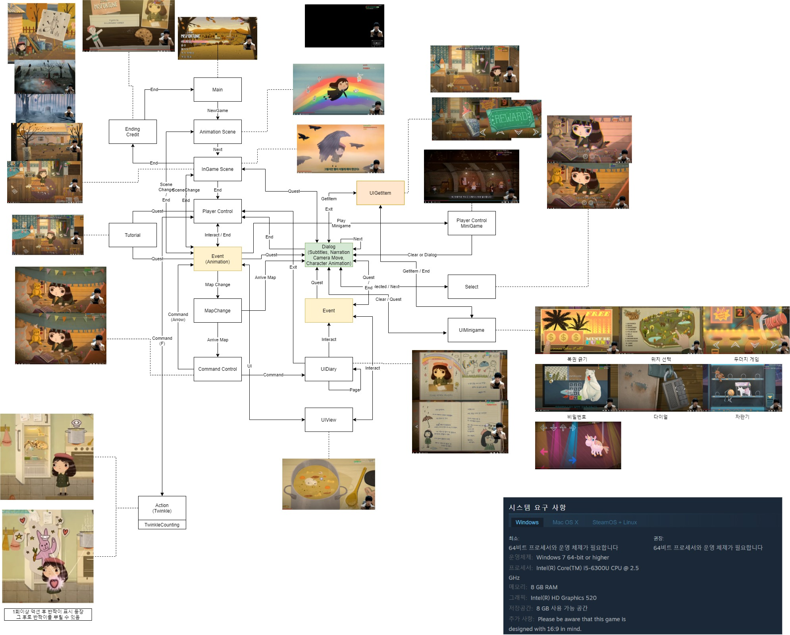

# 포트폴리오
## 1. 이력
* Email : listener312@gmail.com

## 2. 보유기술 
* Unity
	+ Stacks : C#, Editor, Cinemachine, Timeline
	+ Utility : Spine, LitJson
* Git
	+ Git : GitLab, GitHub, 
	+ Utility : SourceTree, Git Desktop
* Test Framework
	+ Unity Test Framework	
* Test Driven Develop

## 3. 관심분야
* AI
	+ ML-Agent, Behaviour Tree
* Multicore Process
	+ Unity DOTS
* TDD 
	+ Test Framework
* 코드작성법과 리팩토링
	+ Code Complete 2 도서

## 4. 경력사항 - 3년 4개월
* (주)GamBridzy
	+ Unity 클라이언트 프로그래머
	+ 2018년 6월 - 2021년 9월 | 3년 4개월

## 5. 경력 프로젝트
### > [출시] The Wednesday - [19.05 ~ 20.12] <
+ https://store.steampowered.com/app/1119610/The_Wednesday/
#### 1. 개발인원 및 포지션
+ 총 10명 (기획 1명, 2D 그래픽 2명, 3D 그래픽 3명, 애니메이터 1명, 프로그래머 3명)
+ 프로그래머 : 게임 시스템 설계 및 개발
#### 2. 개발환경
+ Unity 2019.3 LTS
+ 언어 : C#
+ OS : Windows 10
#### 3. 사용기술 및 툴
+ Unity Editor
+ Unity Cinemachine
+ Unity Timeline
+ Google Spread Sheep -> Export Sheet Data
+ LitJson
#### 4. 개발 내용 설명
+ 게임 시스템 구조 설계 및 개발
	- 플레이어, 맵, 상호작용자 관계 구축
	- 계정, 사운드, 시나리오, 퀘스트는 Singleton을 사용하여 하나의 인스턴스로 진행 
	- 플레이어 
		- NavMesh 사용하여 x축으로 이동제작. 마우스 키보드 입력 및 단축키 적용
	- 맵 
		- 플레이어와 상호작용자가 배치되는 맵. 퀘스트 값에 따라 일반맵, 은신맵, 상호작용자 활성, 비활성이 진행됨.
	- 상호작용자
		- Interact를 상속받은 개체는 Interact Update로 매 프레임 읽으며 플레이어 접근시 상호작용 가능하다는 메소드 실행 (CallInteract)
		- 상호작용 명령이 내려오면 상호작용 후 Interact를 상속한 자식 클래스 실행 (ActionInteract)
		- 플레이어가 떠나면 상호작용 떠남 메소드 실행 (LeaveInteract)
	- 계정
		- 플레이어가 현재 진행했던 데이터 모음
		- 실시간 저장을 진행하도록 IAccountData 추상화하여 직렬화 된 데이터를 AccountIO를 활용해 데이터 저장
		- 불러오기시 반대로 저장된 데이터를 역직렬화하여 데이터 불러오기
	- 퀘스트 
		- 특정 행동이 일어나면 해당하는 행동의 enum Type을 QuestManager에 전달. 
		- 조건에 부합하는 Quest가 있으면 Account에 Quest 등록 후 상호작용자 활성 및 비활성화 진행 후 연출 실행
		- Quest Table을 제작하고 json으로 출력
	- 대사
		- 해당 메인 대사 키 제작
		- 메인 대사키를 가진 대사 리스트를 파싱
		- Dialogue Table을 제작하고 json으로 출력
	- 사운드
		- AudioMixer사용
	- 데이터
		- 아이템, 퀘스트, 대사, 단서 테이블 ScriptableObject 제작
		- ItemStorage, QuestManager 등 데이터 모음 클래스를 제작하여 사용할 루틴이 꺼내서 쓰도록 함
+ 엑셀 테이블 제작 및 Export Sheet Data 플러그인을 활용하여 번역 데이터 json출력 후 적용하여 LitJson으로 파싱 (한, 영, 중)
+ Unity Cinemachine을 활용한 카메라 구도 및 연출 적용
+ Unity Timeline을 활용한 카메라 구도, 캐릭터 이동, 대사 연출 타임라인 적용
#### 5. 개발 성과
+ 텀블벅 이후 스팀에 출시 성공 [2020.12] 
+ 영어 번역판 업데이트 [2020.12]
+ 중국어 번역판 업데이트 [2020.03]
***
### > [취소] 8인의 죽음 - [21.01 ~ 21.09] <
#### 1. 개발인원 및 포지션
+ 총 7명 (기획 1명, 2D 그래픽 3명, 애니메이터 1명, 프로그래머 2명)
+ 프로그래머 : 입력, UI 개발
#### 2. 개발환경
+ Unity 2020.3 LTS 버전 사용
+ 언어 : C#
+ OS : Windows 10
#### 3. 사용기술 및 툴
+ Spine
+ Unity Graph Shader
+ Unity New InputSystem
+ Soft Mask UI 오픈소스
	- https://github.com/mob-sakai
#### 4. 개발 내용 설명
+ 벤치마킹 게임 분석 (Tangle Tower, When the Past was Around, Fran Bow, Little Misfortune)
	
	
	
	
+ Unity New InputSystem을 활용한 마우스 키보드 바인딩 진행
+ Spine을 활용한 대사화면 NPC 애니메이션 실행
+ Unity Graph Shader를 활용한 기초 쉐이더 테스트
	+ Doodle Effect
	+ Disolve Effect
+ Soft Mask UI 오픈소스 적용
***
### > [완료] 행복누리 프로젝트 - [19.01 ~ 19.04] <
#### 1. 개발인원 및 포지션
+ 총 2명 (2D 그래픽 1명, 프로그래머 1명)
+ 프로그래머 : 프로젝트 마무리 및 서버 이전
#### 2. 개발환경
+ Unity 2019.3 LTS
+ 언어 : C#
+ 서버 : Cafe 24 Ubuntu Linux
+ 웹언어 : PHP
+ DB : Mysql
#### 3. 사용기술
+ Unity WWW 통신  
#### 4. 개발 내용 설명
+ 프로젝트 마무리 개발
+ 디버깅 진행
+ Cafe 24를 활용한 서버 구축 및 APM 설치 후 호스트 변경에 의한 서버 이전 
#### 5. 개발 성과
+ 서울대병원 소아청소년정신과 납품 완료
	- https://www.youtube.com/watch?v=GoKz2dQuJqI
	- https://www.checkyourhealth.co.kr/news/articleView.html?idxno=1223
***
### > [출시] 아샤 런 - [18.06 ~ 18.09] <
+ https://www.youtube.com/watch?v=pPHGg6cq-DQ
#### 1. 개발인원 및 포지션
+ 총 3명 (기획 1명, 2D 그래픽 1명, 프로그래머 1명)
+ 프로그래머 : 프로젝트 마무리 및 GPGS, Firebase, Facebook API 적용
#### 2. 개발환경
+ 개발환경 : Unity 2019.3 LTS
+ 언어 : C#
+ OS : Windows 10
#### 3. 사용기술
+ Unity Editor
+ Spine
+ GPGS, Google Firebase Realtime Database, Facebook API
#### 4. 개발 내용 설명
+ GPGS, Facebook API 계정 연동 적용
+ Google Firebase Database의 Nosql을 활용하여 랭킹, 쿠폰, 결제로그, 유저데이터 저장소 사용
+ Spine을 활용하여 캐릭터 애니메이션 실행
+ Unity Editor를 활용하여 아이템 등장 패턴 제작
#### 5. 개발 성과
+ Google Play Store 출시 성공 [18.09]
+ 1개월 후 3만 다운로드 달성

## 6. 토이 프로젝트
### > [진행] 야수 엠파이어 - [21.05 - 진행중] <
+ https://github.com/LiztyStalker/BeastEmpire
+ https://github.com/LiztyStalker/BeastEmpire_Build
	- Prototype 2 - [21.05 ~ 21.10] 
+ https://www.youtube.com/watch?v=YABfKev9TWk
#### 1. 개발인원 및 포지션
+ 개인 프로젝트
#### 2. 개발환경
+ 개발환경 : Unity 2020.3 LTS
+ 언어 : C#
+ OS : Windows 10
#### 3. 사용기술
+ Unity Editor
+ Spine
+ Unity Test Framework
+ AssetBundle
#### 4. 개발 내용 설명
+ AssetBundle을 활용하여 데이터 통합 및 데이터 저장소 시스템 구현
+ TestFramework를 활용하여 PlayMode, EditMode 단위 및 통합 테스트
	- EditMode - 제작한 루틴 단위 테스트 (블록 범위, 위치, 목표 데이터 처리)
	- PlayMode - 제작한 스킬, 병사, 명령, 밸런스 통합 테스트
+ Spine을 활용하여 캐릭터 움직임 구현
+ Unity Editor 및 json을 활용하여 캐릭터, 스킬, 상태이상 데이터 구현
	- json 데이터를 기반으로 자동 병사 생성기 제작 (UnitGenerator)
#### 5. 개발 성과
+ Prototype 2 지인들에게 배포 및 피드백 [2021.10]
	- 개선사항 발생, 차기 Prototype 3를 위해서 추가 작업 내용 작성
	- 리팩토링 및 기획 진행 후 차기 Prototype 3 진행 예정 
	

## 7. 학력
* 강릉원주대학교 원주캠퍼스 컴퓨터공학과 [졸업] - (2010.03 ~ 2016.02)

## 8. 자격증
* 정보처리기사 - (2016.05)
